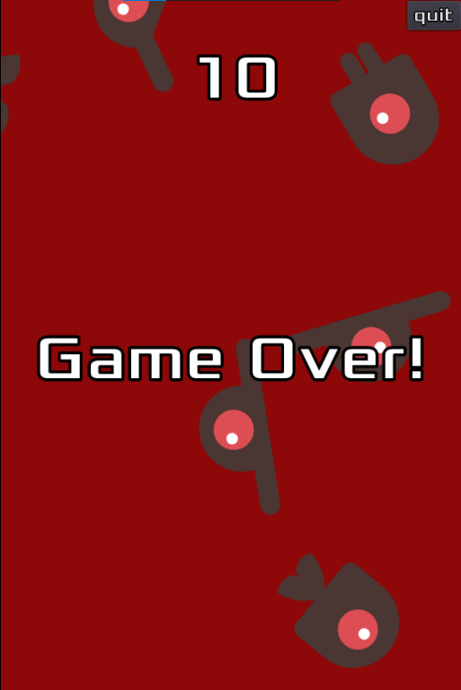

# Dodge-the-creeps
A fun game made with Godot engine and GDScript

## Contribution

Feel free to contribute for any idea that comes to mind

## Sample Images

## Why Godot?

I was just googling some other open-source game engines and I found Godot came as a result and said to myself "lets give it a shot". I really enjoyed and continue to enjoy my time learning it. So simple that it blows your mind to think of a game engine with that simplicity

## Behind the Scenes(GDScript)

It's pretty basic stuff for any 2D game using GDScript as the scripting language for the project along with some basic classes for each object such as Animated Sprites and 2D Collision triggers and some timers for score logic and spawning enemies on the screen walking in random directions